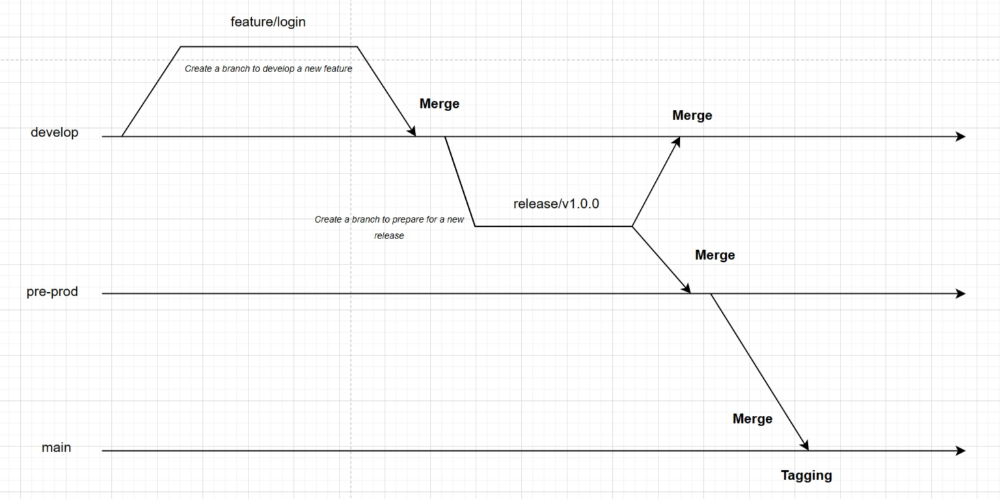
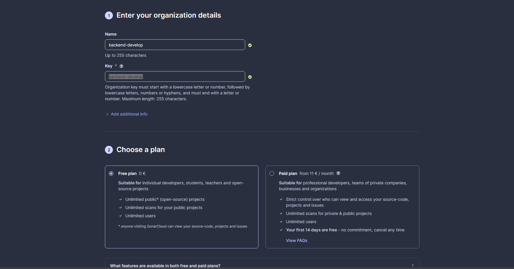
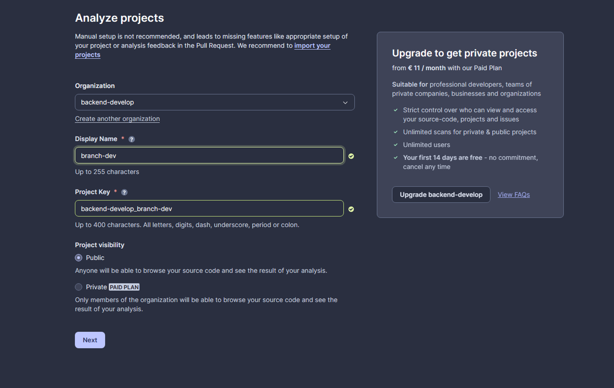

# CI/CD Pipeline on Kubernetes Cluster with GitLab CI and ArgoCD

This document outlines the steps required to set up a Continuous Integration and Continuous Deployment (CI/CD) pipeline using GitLab CI and ArgoCD on a Kubernetes (K8s) cluster. This setup ensures that your applications are automatically tested, built, and deployed to your Kubernetes cluster whenever you push code changes to your GitLab repository.

## Prerequisites

Before you begin, ensure you have the following:

1. An AWS account, with suitable IAM permissions to interact with AWS.
2. A GitLab server.
3. GitLab Runner installed and configured.
4. Docker installed on the machine where GitLab Runner is running (if using Docker executor).

## Step 1: Working with Gitlab server

1. Create 3 repositories:
   1. Backend repo
   2. Frontend repo
   3. Manifest repo, storing K8s manifest files with 3 folders: dev, pre-prod, prod

2. On the backend and frontend repo, create branches following this diagram

   

3. Protect the develop, pre-prod and main branch, and v* tags.

4. Head to the CI/CD settings and install gitlab runner.

## Step 2: Install Gitlab runner

1. Create a VM, with 8GB RAM and 30GB block storage.

2. Run the following commands:

   ```bash
   sudo -i
   apt update
   curl -L "https://packages.gitlab.com/install/repositories/runner/gitlab-runner/script.deb.sh" | bash
   apt-get install gitlab-runner
   apt-cache madison gitlab-runner
   gitlab-runner -version

   sudo gitlab-runner register --url https://gitlab.ops-ai.dev/ --registration-token <<token>>
   ```

3. Add gitlab-runner to docker group, which will allow gitlab-runner to exec docker commands.
4. Run this command to run gitlab-runner
   
   ```
   nohup gitlab-runner run --working-directory /home/gitlab-runner/ --config /etc/gitlab-runner/config.toml --service gitlab-runner --user gitlab-runner 2>&1 &
   ```
5. Now we could write gitlab-ci **script** to trigger the CI/CD pipeline.

## Step 3: Use SonarQube with SonarCloud to scan static code
1. Write unit tests for the application and store the reports in the artifacts
2. Use those artifacts in a job called "SAST"
3. Create SonarCloud account
   1. Create organization

      

   2. Create project

      

4. Create a TOKEN and bind that value into the *SONAR_TOKEN* variable.

5. We will use that token later

## Step 4: Setting up infra

**Pre-requisites:**
- aws cli with pmo profile
- kubectl and helm installed on local machine.

**Run ```terraform apply``` from layer 1 to layer 4**

## Step 5: Setting up Istio and nginx-ingress-controller

Apply everything you see in the ```istio-yaml``` folder.

This will create istio-d, and 3 namespaces where the ```dev``` namespace is labeled with istio-injection=true, and ingress-controller with a LB attached to it.

## Step 6: Configure GitLab CI

Create a `.gitlab-ci.yml` file in the root of your GitLab repositories for backend, and frontend. 

This file will be the script to determine how the runner should work.

## Step 7: Pre-config for our app

1. Create secret in 3 namespace, for the backend to use it to connect to db

   ```bash
   kubectl create secret generic backend-secret \
   --from-literal=NODE_ENV=<<YOUR ENV>> \
   --from-literal=DB_USERNAME=<<YOUR USERNAME>> \
   --from-literal=DB_PASSWORD=<<YOUR PASSWORD>> \
   --from-literal=DB_DATABASE=<<YOUR DB>> \
   --from-literal=DB_HOST=<<YOUR DB HOST>> \
   --from-literal=DB_DIALECT=<<YOUR DIALECT>> \
   --from-literal=DB_LOGGING=<<ENABLE LOGGING IN THE BACKEND POD>>
   ```

2. Create mysql db with helm in 3 namespace
   
   ```
   helm install mysql --set auth.rootPassword=admin12345$,auth.database=app_database,primary.persistence.size=2Gi,primary.persistence.storageClass=gp2,global.storageClass=gp2 oci://registry-1.docker.io/bitnamicharts/mysql
   ```

## Step 8: Config ArgoCD

1. Expose the argo cd UI server 

   ```
   kubectl patch svc argocd-server -n argocd -p '{\"spec\": {\"type\": \"LoadBalancer\"}}’
   kubectl -n argocd get secret argocd-initial-admin-secret -o jsonpath=" {.data.password}"
   ```

2. Get a token from gitlab to connect to the manifest repo from argo, and start connecting
3. Add 3 apps, one from dev, one from pre-prod, and one from prod

## Step 9: Configure monitoring tools Prometheus, Grafana

1. Create a namespace called monitoring
2. Install Prometheus, Grafana using helm
   
   ```yaml
   helm repo add prometheus-community https://prometheus-community.github.io/helm-charts
   helm repo update
   helm install [RELEASE_NAME] prometheus-community/kube-prometheus-stack -n=monitoring
   ```
---